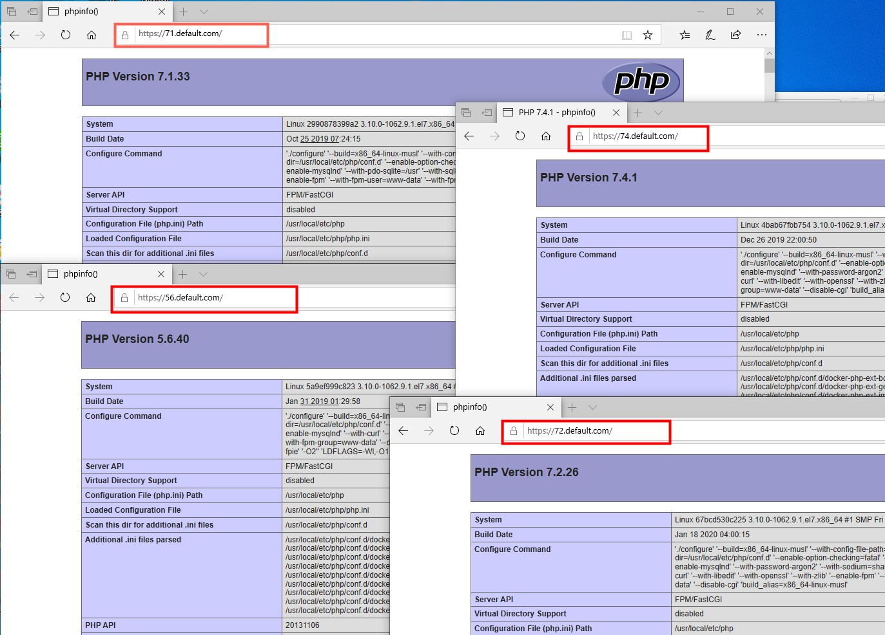
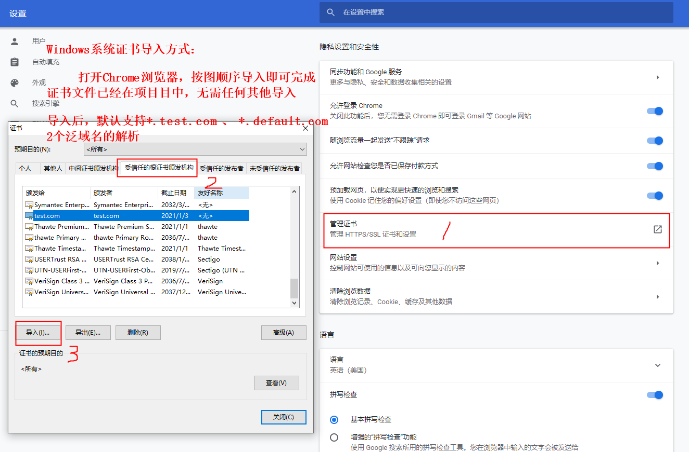

HG_DNMP取自（Docker + Nginx + MySQL5.7 + PHP7/5）的简称，当然我们不仅仅满足于支持DNMP这点功能，HG_DNMP是一款全功能的**DNMP一键安装程序**，还支持Redis 、Postgresql 、 Confluence 、 Gitlab等。
即可满足本地开发环境的使用，亦可做为生产环境服务端的部署，同时也是学习docker编排的最好demo实例。

本项目在保证规范统一的大前提下，针对同一方式的，尽量会使用不同写法，目的就是为了便于docker编排学习。

### HG_DNMP项目特点：
```
1. `100%`开源，基于alpine镜像，遵循Docker标准
2. 采用最新Docker版本制作
3. 支持**多版本PHP**共存，可任意切换（PHP5.6、PHP7.1、PHP7.2、PHP7.3、PHP7.4)
4. 默认php支持webp图片格式
5. 支持绑定**任意多个域名**
6. 支持**HTTPS和HTTP/2**
7. **PHP源代码、MySQL数据、配置文件、日志文件**可根据需求实现自定义
8. 内置**完整PHP扩展安装**命令
9. 支持php常用热门扩展，如grpc, swoole等【具体扩展可参考.env动态调整】
10. 实际项目中应用，确保`100%`可用
11. 一次配置，**Windows、Linux、MacOs**皆可用
12. 通过bg-sync进行访问加速，解决开发环境中项目运行缓慢情况
```

### 约定：
```
1、默认提供证书为*.default.com泛域名。如果作为本地开发环境使用，请根据当前约定，自行修改本机默认的hosts文件；
生产环境下使用，请修改.env和conf/conf.d下相关配置文件后，再执行安装，避免安装后的再调整。

2、conf/conf.d下的关于nginx的vhost文件，根据需要请在执行安装前，自行删减，避免安装后nginx报错。

3、php提供Debian和alpine镜像两种方式，默认使用Alpine镜像，如果php扩展在alpine镜像下不支持，可以使用debian镜像的编排，具体实例可参考docker-compose.yml中php72-debian

4、当前发布时，alpine镜像版的php 7.4.1，暂不支持gd库。

5、约定地址：

    jenkins访问地址：https://jenkins.default.com
    gitlab访问地址：https://gitlab.default.com
    confluence访问地址：https://confluence.default.com
    php 5.6测试地址：https://56.default.com
    php 7.1测试地址：https://71.default.com
    php 7.2测试地址：https://72.default.com
    php 7.3测试地址：https://73.default.com
    php 7.4测试地址：https://74.default.com

6、为了提高国内下载构建速度，相关软件包全部放在根目录下的src下，请通过百度网盘下载后，放在根目录下即可。
    网盘下载链接：https://pan.baidu.com/s/1dkEz_BZJo1901fxWTFxiXA     提取码：6eao
```

## 终极效果演示：


# 1.项目结构
目录说明：
```
../hg_dnmp/
├── build           项目构建文件夹
│   ├── certbot
│   ├── confluence
│   ├── gitlab
│   ├── mongo
│   ├── php         基于alpine镜像的php
│   ├── php-debian  基于debian镜像的php (便于部分扩展在alpine下构建不支持，可切换到debian镜像)
│   ├── postgres
│   ├── python
│   └── redis
├── centos7-optimizer.sh        centos7优化脚本
├── conf                        相关配置文件
│   ├── conf.d                  Nginx用户站点配置目录
│   │   ├── certs               https证书目录
│   ├── mysql.cnf               MySQL用户配置文件
│   ├── nginx.conf              Nginx配置文件
│   ├── php                     Php配置文件
│   └── redis.conf              Redis配置文件
├── docker-allip
├── docker-compose-Darwin.yml   Mac系统使用的docker sync相关yml文件
├── docker-compose-Linux.yml    Linux系统使用的docker sync相关yml文件
├── docker-compose.yml
├── docker-sync.yml
├── include
├── logs         日志目录
├── README.md
├── snapshot
└── src          程序源码安装包 - 减少安装过程中的下载时间（如果修改软件版本号，建议提前下载好放进来）

```

# 2. 使用说明
1. 本地安装`git`、`docker`和`docker-compose`

    CentOS 7用户可以通过提供的centos7-optimizer.sh脚本一键安装

2. `clone`项目：
    ```
    $ git clone https://gitee.com/indextank/hg_dnmp.git
    ```
3. 如果不是`root`用户，还需将当前用户加入`docker`用户组：
    ```
    $ sudo gpasswd -a ${USER} docker
    ```
4. 常用命令：

    4.1 创建并且启动所有容器 (-d，代表后台运行方式)
    ```
    $ docker-compose -f docker-compose.yml up -d
    ```

    此种方式，不推荐~建议根据个人需要，启动相应的服务即可。比如启动nginx+mysql
    ```
    $ docker-compose up nginx mysql57
    ```

    4.2 启动并进入单个容器
    ```
    $ docker run -it mysql:5.7 /bin/bash
    ```
    4.3 构建或者重新构建服务
    ```
    $ docker-compose build php72
    ```
    4.4 启动|停止|重启服务
    ```
    $ docker-compose start|stop|restart 服务1 服务2 ...
    或
    $ docker start|stop|restart  服务1 服务2 ...
    ```
    4.5 进入命令行容器
    ```
    $ docker-compose exec 服务 bash
    或
    $ docker exec -it 服务 /bin/sh
    ```
    4.6 停止并删除容器，网络，图像和挂载卷
    ```
    $ docker-compose down 服务1 服务2 ...
    ```
    4.7 删除容器
    ```
    $ docker-compose rm 容器ID
    ```
    4.8 删除镜像
    ```
    $ docker-compose rmi 镜像ID
    ```
    4.9 批量删除容器
    ```
    $ docker container rm $(docker container ls -a -q)
    ```
    4.10 批量删除镜像
    ```
    $ docker image rm $(docker image ls -a -q)
    ```
    4.11 批量删除无用镜象（三种方式都可以，想强制删除可在rmi后加-f）
    ```
    docker images | grep none | awk '{print $3}' | xargs docker rmi
    docker rmi $(docker images | grep "^" | awk "{print $3}")
    docker rmi $( docker images -f dangling=true)
    ```
    4.12 mac上安装docker-sync
    ```
    $ gem install docker-sync
    $ brew install fswatch
    $ brew install unison
    $ brew install eugenmayer/dockersync/unox
    $ echo 'export PATH="/usr/local/lib/ruby/gems/2.6.0/bin:$PATH"' >> ~/.bash_profile
    $ source ~/.bash_profile
    $ docker-sync start  或 docker-sync-stack start
    ```
    4.13 使用 docker-sync 让 Mac/Linux 和 docker 之间的文件同步变快【 仅支持Mac/Linux 】
    ```
    $ docker-compose -f docker-compose.yml -f docker-compose-$(uname -s).yml up
    ```
    4.14 以守护进程方式启动 【推荐使用】
    ```
    $ docker-sync-daemon start  && docker-compose up -d
    ```


# 3. 切换PHP版本？
切换PHP仅需修改相应站点 Nginx 配置的`fastcgi_pass`选项，

例如，示例的**localhost**用的是PHP5.6，Nginx 配置：
```
    fastcgi_pass   php56:9000;
```
要改用PHP7.3，修改为：
```
    fastcgi_pass   php73:9000;
```
再**重启 Nginx** 生效
```
    $ docker-compose restart nginx
```


# 4. 添加快捷命令
在开发的时候，我们可能经常使用docker exec -it切换到容器中，把常用的做成命令别名是个省事的方法。

Linux系统打开~/.bashrc (Mac OS系统打开~/.bash_profile)，加上：
```bash
alias dnginx='docker exec -it nginx /bin/sh'
alias dphp73='docker exec -it php73 /bin/bash'
alias dphp56='docker exec -it php56 /bin/bash'
alias dmysql5='docker exec -it mysql57 /bin/bash'
alias dredis='docker exec -it redis /bin/bash'
alias dpostgre='docker exec -it postgresql /bin/sh'
```
然后执行
```
    source ~/.bashrc  或  source ~/.bash_profile
```
后期使用中，如果想进入容器，直接在终端输入别名即可。

# 5. 在正式环境中安全使用
要在正式环境中使用，请注意相关配置调整：
1. 在php.ini中关闭XDebug调试及错误级别(默认错误级别为ALL)
2. 增强MySQL数据库访问的安全策略
3. 增强redis访问的安全策略，默认bind为0.0.0.0

# 6. 使用Logs

默认所有日志，会全部归结到logs文件夹下各自的项目文件夹中，如果需要修改日志路径，请对应修改各自程序的配置文件即可。

# 7. 使用composer
dnmp默认已经在容器中安装了composer，使用时先进入容器：
```
$ docker exec -it php73 /bin/bash
```
然后进入相应目录，使用composer：
```
# cd /var/www/html/default
# composer update
```
因为composer依赖于PHP，所以，是必须在容器里面操作composer的。


# 8. Confluence使用
### 关于Confluence破解方法：
将atlassian-extras-decoder-v2-3.4.1.jar 从Confluence docker容器里复制到本地，用keygen.sh破解（.patch按钮），然后将破解后的文件复制回去，重启Confluence

ps1: 破解文件在build/confluence目录下

ps2: atlassian-extras-decoder-v2-3.4.1.jar会随着confluence版本的不同，而不同，以实际为准

```
$ docker cp confluence:/opt/atlassian/confluence/confluence/WEB-INF/lib/atlassian-extras-decoder-v2-3.4.1.jar ./
$ mv atlassian-extras-decoder-v2-3.4.1.jar atlassian-extras-2.4.jar
$ ... (此处需要用hg_dnmp/build/confluence/confluence_keygen.jar文件进行打补丁...打完补丁以后...)
$ mv atlassian-extras-2.4.jar atlassian-extras-decoder-v2-3.4.1.jar
$ docker cp ./atlassian-extras-decoder-v2-3.4.1.jar confluence:/opt/atlassian/confluence/confluence/WEB-INF/lib/
$ docker-compose restart confluence
```

# 9. Gitlab使用
默认gitlab使用的CE社区版，启用的是内置nginx，内置80端口做了映射转换。

如果需要编辑gitlab配置文件
```
$ docker exec -it gitlab vim /etc/gitlab/gitlab.rb
$ docker restart gitlab
```


### #关于Confluence使用postgresql数据库方法
默认Confluence使用postgresql数据库，所以confluence依赖与postgres,并且在postgres创建的时候，默认会创建供Confluence使用的数据空间及账号密码（可以从.env查看）

ps: 在Confluence设置数据库的界面中，Hostname，请填写postgres的container_name镜像名称。

### 关于Confluence使用mysql数据库方法
默认已经将mysql支持的jar包括在系统中了，如果设置选择Mysql提示没有，需要自行将src/confluence目录下的mysql-connector-java-8.0.18.jar拷贝到docker镜像中
```
docker cp ./build/confluence/mysql-connector-java-8.0.18.jar confluence:/opt/atlassian/confluence/confluence/WEB-INF/lib
docker-compose restart confluence
```
ps: 在Confluence设置数据库的界面中，Hostname，请填写mysql57的container_name镜像名称。

## 常见问题
1. 如何开启本地https，且实现本地证书可信任
    > Mac OS系统：
    打开“钥匙串访问”工具，导入conf/conf.d/certs/localRootCA.crt证书，并全部设置为可信任即可。

    > Windows系统：在Chrome浏览器的“设置”中
    


2. 本地哪些域名默认支持https正常显示访问？
   默认localRootCA.crt里面，设置了如下域名的泛解析证书
    ```
    *.default.com
    *.test.com
    ```
    假设某项目本地地址为：https://71.default.com,
    那么只需在本机的hosts里面加入:
    > 127.0.0.1 71.default.com

    即可正常访问

3. 自定义本地域名：
    编辑conf/conf.d/certs/localRootCA.conf底部内容，按照现有格式，修改成自己喜欢的域名格式
    然后执行
    ```
    $ openssl req -config localRootCA.conf -new -sha256 -newkey rsa:2048 -nodes -keyout localRootCA.key -x509 -days 365 -out localRootCA.crt
    ```
    即可重新生成自己的localRootCA.crt证书，在执行导入即可。

## Author
作者：Euper

QQ: 272457050


## License
GPL-3.0