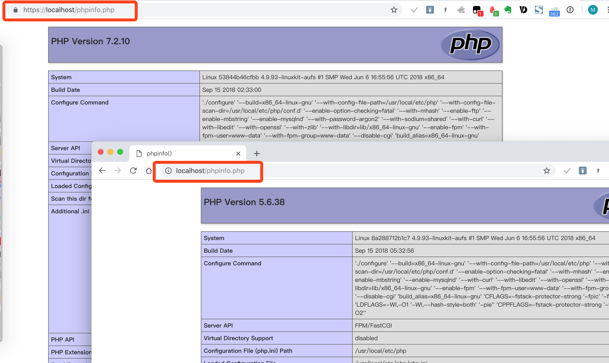
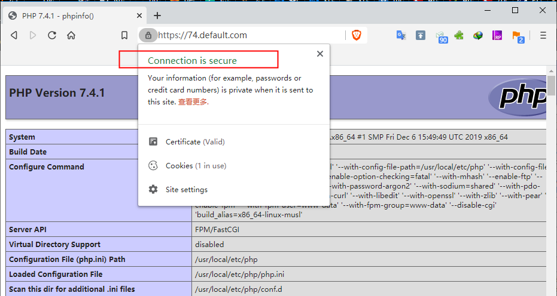

HG_DNMP（Docker + Nginx + MySQL5.7 + PHP7/5 + Redis + Gogs + Postgresql）是一款全功能的**LNMP一键安装程序**。

HG_DNMP项目特点：
1. `100%`开源，遵循Docker标准
2. 采用最新Docker版本制作（version: 3.7）
3. 支持**多版本PHP**共存，可任意切换（PHP5.6、PHP7.2)
4. 支持绑定**任意多个域名**
5. 支持**HTTPS和HTTP/2**
6. **PHP源代码、MySQL数据、配置文件、日志文件**都可在Host中直接修改查看
7. 内置**完整PHP扩展安装**命令
8. 默认安装`pdo_mysql`、`redis`、`xdebug`、`swoole`、`grpc`、`seaslog`、`protobuf`、`zookeeper`、`seaslog`、`mongodb`、`tideways`、`xhprof`等常用热门扩展【可根据需要动态调整】
9. 默认php支持webp图片格式
10. 带有phpredisadmin数据库在线管理程序 (默认不安装，可手动开启注释代码)
11. 实际项目中应用，确保`100%`可用
12. 一次配置，**Windows、Linux、MacOs**皆可用
13. 通过bg-sync进行访问加速，解决环境中项目运行缓慢情况


### 终极效果演示：


## 1.项目结构
目录说明：
```
/
hg_dnmp/
├── README.md
├── build                   项目构建文件夹
│   ├── mongo
│   ├── php                 基于alpine镜像的php
│   ├── php-debian          基于debian镜像的php
│   ├── python
│   └── redis
├── conf                    配置文件目录
│   ├── conf.d              Nginx用户站点配置目录
│   ├── nginx.conf          Nginx默认配置文件
│   ├── mysql.cnf           MySQL用户配置文件
│   ├── php-fpm.conf        PHP-FPM配置文件（部分会覆盖php.ini配置）
│   └── php.ini             PHP默认配置文件
│   └── redis.conf          Redis配置文件
├── docker-allip            可执行命令，显示docker虚拟机的ip
├── docker-compose-Darwin.yml       Mac系统使用的docker sync相关yml文件
├── docker-compose-Linux.yml        Linux系统使用的docker sync相关yml文件
├── docker-compose.yml
├── docker-sync.yml
├── logs                    日志目录
├── snapshot                
└── www                     项目目录

```

## 2. 使用说明
1. 本地安装`git`、`docker`和`docker-compose`。
2. `clone`项目：
    ```
    $ git clone https://gitee.com/indextank/hg_dnmp.git
    ```
3. 如果不是`root`用户，还需将当前用户加入`docker`用户组：
    ```
    $ sudo gpasswd -a ${USER} docker
    ```
4. 常用命令：

    4.1 创建并且启动所有容器(-d，代表后台运行方式)
    ```
    $ docker-compose -f docker-compose.yml up -d
    ```
    4.2 启动单个容器
    ```
    $ docker run -it mysql:5.7 /bin/bash
    ```
    4.3 构建或者重新构建服务
    ```
    $ docker-compose build php72
    ```
    4.4 启动|停止|重启服务
    ```
    $ docker-compose start|stop|restart 服务1 服务2 ...
    ```
    4.5 进入命令行容器
    ```
    $ docker-compose exec 服务 bash
    ```
    4.6 删除并且停止容器
    ```
    $ docker-compose rm 服务1 服务2 ...
    ```
    4.7 停止并删除容器，网络，图像和挂载卷
    ```
    $ docker-compose down 服务1 服务2 ...
    ```
    4.8 批量删除容器
    ```
    $ docker container rm $(docker container ls -a -q)
    ```
    4.9 批量删除镜像
    ```
    $ docker image rm $(docker image ls -a -q)
    ```
    4.10 mac上安装docker-sync
    ```
    $ gem install docker-sync
    $ brew install fswatch
    $ brew install unison
    $ brew install eugenmayer/dockersync/unox
    $ echo 'export PATH="/usr/local/lib/ruby/gems/2.6.0/bin:$PATH"' >> ~/.bash_profile
    $ source ~/.bash_profile
    $ docker-sync start  或 docker-sync-stack start
    ```
    4.11 使用 docker-sync 让 mac 和 docker 之间的文件同步变快【 仅支持Mac/Linux 】
    ```
    $ docker-compose -f docker-compose.yml -f docker-compose-$(uname -s).yml up  
    ```
    4.12 以守护进程方式启动 【推荐使用】
    ```
    $ docker-sync-daemon start  && docker-compose up -d
    ```
5. 访问在浏览器中访问：

 - [http://localhost](http://localhost)： 默认*http*站点
 - [https://localhost](https://localhost)：自定义证书*https*站点，访问时浏览器会有安全提示，忽略提示访问即可. 
 下面会有介绍如何在本地开发导入https证书


## 3. 切换PHP版本？
默认情况下，我们同时创建 **PHP5.6和PHP7.3** 2个PHP版本的容器，

切换PHP仅需修改相应站点 Nginx 配置的`fastcgi_pass`选项，

例如，示例的**localhost**用的是PHP5.6，Nginx 配置：
```
    fastcgi_pass   php56:9000;
```
要改用PHP7.3，修改为：
```
    fastcgi_pass   php73:9000;
```
再
```
    $ docker-compose restart nginx
```
 **重启 Nginx** 生效。

## 4. 添加快捷命令
在开发的时候，我们可能经常使用docker exec -it切换到容器中，把常用的做成命令别名是个省事的方法。

Linux系统打开~/.bashrc (Mac OS系统打开~/.bash_profile)，加上：
```bash
alias dnginx='docker exec -it nginx /bin/sh'
alias dphp73='docker exec -it php73 /bin/bash'
alias dphp56='docker exec -it php56 /bin/bash'
alias dmysql5='docker exec -it mysql57 /bin/bash'
alias dredis='docker exec -it redis /bin/bash'
alias dpostgre='docker exec -it postgresql /bin/sh'
```
然后执行
```
    source ~/.bashrc  或  source ~/.bash_profile
```
后期使用中，如果想进入容器，直接在终端输入别名即可。

## 5. 使用Log

Log文件生成的位置依赖于conf下各logs配置的值。

### 5.1 Nginx日志
Nginx日志是我们用得最多的日志，所以我们单独放在根目录`logs`下。

`logs`会目录映射Nginx容器的`/var/log/dnmp`目录，所以在Nginx配置文件中，需要输出log的位置，我们需要配置到`/var/log/dnmp`目录，如：
```
error_log  /var/log/dnmp/nginx.localhost.error.log  warn;
```


### 5.1 PHP-FPM日志
大部分情况下，PHP-FPM的日志都会输出到Nginx的日志中，所以不需要额外配置。

如果确实需要，可按一下步骤开启。

1. 在主机中创建日志文件并修改权限：
    ```bash
    $ touch log/php-fpm.error.log
    $ chmod a+w log/php-fpm.error.log
    ```
2. 主机上打开并修改PHP-FPM的配置文件`conf/php-fpm.conf`，找到如下一行，删除注释，并改值为：
    ```
    php_admin_value[error_log] = /var/log/dnmp/php-fpm.error.log
    ```
3. 重启PHP-FPM容器。

### 5.2 MySQL日志
因为MySQL容器中的MySQL使用的是`mysql`用户启动，它无法自行在`/var/log`下的增加日志文件。所以，我们把MySQL的日志放在与data一样的目录，即项目的`mysql`目录下，对应容器中的`/var/lib/mysql/`目录。
```bash
slow-query-log-file     = /var/lib/mysql/mysql.slow.log
log-error               = /var/lib/mysql/mysql.error.log
```
以上是mysql.conf中的日志文件的配置。

## 6. 使用composer
dnmp默认已经在容器中安装了composer，使用时先进入容器：
```
$ docker exec -it php73 /bin/bash
```
然后进入相应目录，使用composer：
```
# cd /var/www/html/localhost
# composer update
```
因为composer依赖于PHP，所以，是必须在容器里面操作composer的。

## 7. phpredisadmin
本项目默认在`docker-compose.yml`中加入了用于redis在线管理的*phpRedisAdmin*，可以根据需要修改或删除。（需要手动取消代码注释，开启）

phpRedisAdmin容器映射到主机的端口地址是：`8081`，所以主机上访问phpMyAdmin的地址是：
```
http://localhost:8081
```

Redis连接信息如下：
- host: (本项目的Redis容器网络)
- port: `6379`

## 8. 在正式环境中安全使用
要在正式环境中使用，请：
1. 在php.ini中关闭XDebug调试及错误级别(默认错误级别为ALL)
2. 增强MySQL数据库访问的安全策略
3. 增强redis访问的安全策略

## 常见问题
1. 如何开启本地https，且实现本地证书可信任
    > 这里以Mac OS为例： 
    打开“钥匙串访问”工具，导入conf/conf.d/certs/localRootCA.crt证书，并全部设置为可信任即可。

其它系统原理一样，导入localRootCA.crt证书即可
```
暂时本机（Mac OS 10.14）测试支持chrome、Safari浏览器，frefox下貌似不支持
```

2. 本地哪些域名默认支持https正常显示访问？
   默认localRootCA.crt里面，设置了如下域名的泛解析证书
```
*.php.local
*.java.local
*.python.local
*.go.local
*.local.com
*.style.com
localhost
127.0.0.1
172.16.100.199  [本机内网IP]
192.168.1.199   [本机内网IP]
```
假设某项目本地地址为：https://default.php.local, 
那么只需在hosts里面加入:
> 127.0.0.1 default.php.local

即可正常访问



3. 我想自己定义本地域名，不想用你定义好的本地域名该如何操作？

    编辑conf/conf.d/certs/localRootCA.conf底部内容，按照现有格式，修改成自己喜欢的域名格式
    然后执行
```
$ openssl req -config localRootCA.conf -new -sha256 -newkey rsa:2048 -nodes -keyout localRootCA.key -x509 -days 365 -out localRootCA.crt
```
即可重新生成自己的localRootCA.crt证书，在执行导入即可。

3. 如何在PHP代码中使用curl？

这里我们使用curl指的是从PHP容器curl到Nginx容器，比如Nginx中我们配置了：
- www.site1.com
- www.site2.com

在site1的PHP代码中，我们要从site1 curl site2服务器，方法如下。

首先，找到Nginx容器的IP地址，命令：
```
$ docker network inspect dnmp_net-php56
...
    "Containers": {
        ...{
            "Name": "nginx",
            ...
            "IPv4Address": "172.27.0.3/16",
            ...
        },
```
这个命令会显示连接到该网络的所有容器，容器nginx的`IPv4Address`就是nginx的IP地址。
修改docker-compose.yml，在php56服务下加上：
```
  php56:
    ...
    extra_hosts:
      - "www.site2.com:172.27.0.3"
```
这样就可以在www.site1.com中curl site2了。

4. 在本地如何访问gogs?

    > gogs默认访问地址： http://localhost:3000

    相关配置，请修改data/gogs_data/gogs/conf/app.ini内容
    以下为我本地的配置，仅供参考
   
 ```
    APP_NAME = Gogs
    RUN_USER = git
    RUN_MODE = prod

    [database]
    DB_TYPE  = mysql
    HOST     = 172.16.100.199:3306  # 这是我本地ip
    NAME     = gogs
    USER     = root
    PASSWD   = 123456
    SSL_MODE = disable
    PATH     = data/gogs.db

    [repository]
    ROOT = /data/git/gogs-repositories

    [server]
    DOMAIN           = localhost
    HTTP_PORT        = 3000
    
    # 如果需要开启https访问
    # 请拷贝localRootCA.crt和localRootCA.key到/data/gogs/conf/目录下
    PROTOCOL         = https
    ROOT_URL         = https://localhost:3000
    CERT_FILE        = /data/gogs/conf/localRootCA.crt
    KEY_FILE         = /data/gogs/conf/localRootCA.key
    DISABLE_SSH      = false
    SSH_PORT         = 22
    START_SSH_SERVER = false
    OFFLINE_MODE     = false

    [mailer]
    ENABLED = false

    [service]
    REGISTER_EMAIL_CONFIRM = false
    ENABLE_NOTIFY_MAIL     = false
    DISABLE_REGISTRATION   = true
    ENABLE_CAPTCHA         = false
    REQUIRE_SIGNIN_VIEW    = true

    [picture]
    DISABLE_GRAVATAR        = false
    ENABLE_FEDERATED_AVATAR = false

    [session]
    PROVIDER = file

    [log]
    MODE      = file
    LEVEL     = Info
    ROOT_PATH = /app/gogs/log

    [security]
    INSTALL_LOCK = true
    SECRET_KEY   = Js4VHDjrObUKn0m

```

5. 安装时出现错误：
/bin/sh: 1: /tmp/extensions/install.sh: not found
ERROR: Service 'php73' failed to build: The command '/bin/sh -c chmod +x /tmp/extensions/install.sh     && /tmp/extensions/install.sh     && rm -rf /tmp/extensions' returned a non-zero code: 127
该问题目前只在windows下发现，Mac下未出现问题，什么原因暂不清楚，有谁知道的可以告知下。临时解决办法是
> ADD https://gitee.com/indextank/hg_dnmp/raw/master/build/php/extensions/install.sh /tmp/extensions

该方法已经加入了项目代码中。无需重复添加，再次记录下

## License
GPL-3.0


